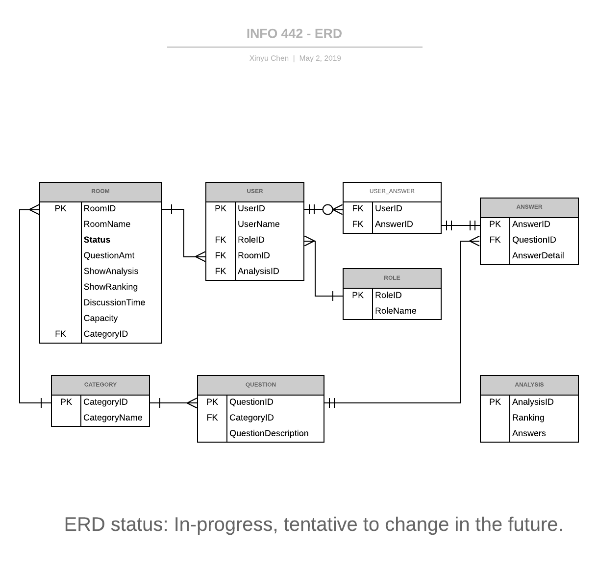

# Homework 4: Architecture Specification
## IntroOutroHandler
A handler which manages start screen and end screen user interaction and interface behavior for the Ice-breaker application. Creates and updates Room’s user interface for start and end behavior. Receives and manages all user input, connecting this input to other components such as `QuestionManager`.
### Properties
Name | Type | Description
-------------| ------------- | ----------
userClass | `String` | The Organizer & Player class, stored from user input. Stored “Organizer” if “new” button is clicked, and “Player” if “join” button is clicked.
roomActive | `number`| The Room Number, stored from user input. 
isDone| `boolean`| True if the organizer has left the room and the room is inactive. Otherwise, default state is false meaning the room is still active.

### Functionality

Name | Parameters | Return | Behavior
------|---------|-----|-----
displayDefault() | none | none |Renders initial webpage where web application title “Dive - In!”. Renders two active buttons: “join” and “new”
displayChoices() | none | none | Renders webpage to the next screen based on the userClass().
endBehavior() | none | none | Creats and displays the end-screen interface. Renders an result message with chosen userClass. 
renderWaitRoom() | none | none | Renders the waiting room and depending whether isDone is true or false new buttons will display accordingly. For instance, if isDone is true then, the “Show Analysis” and “Show Ranking” buttons will appear. 
startGame() | none | none | If the Organizer presses “Start Game”, retrieves a question from `QuestionManager`. Rendering that question for viewers to all see.

### Connections
#### Inputs
- `RoomManager` - Calls to retrieve an `Array<String>` of available `roomClass` names
- `DataManager` - Calls to retrieve `isDone` which indicates whether or not the game process is complete
- Event handler: `onclick` from user input - User indicates choice for `userClass` and `roomClass`

#### Outputs
- `GameManager` - Calls to initialize game process. 

## UserManager
Stores information about users in the active rooms. UserManager can return an `Array<string>` of  **user names**, **user answers**, as well as a specific **user’s id number**. 
### Properties
Name | Type | Description
-----|-----|-----
name | `String` | A user’s name
nameList | `Array<String>` | A list of all the user’s in currently active rooms

### Functionality
Name | Parameters | Return | Behavior
----|----|-----|-----
getNames() | None | `Array<String>` | Return an `Array<String>` of all players names within the room.
getUserAnswers() | `String` | `Array<String>` | Return an `Array<String>` of game answers for a specific player.
setUserRole() | `String`,`String` | none | Sets the users role in the game and returns to `IntroOutroHandler` to differentiate displays.
getUserID() | `String` | number | Returns a number which represents a specific player’s user’s id.

### Connections

#### Inputs
- `InputOutputHandler` - Provides the chosen answers to a particular question currently shown to the user.

#### Outputs
- `InputOutputHandler` - Returns a `UserManager` that corresponds with all the user input information about a particular user.

## QuestionManager
Stores all information about the questions - in particular, which question choices are available to a particular category and which answer options can be chose from the user.

### Properties
Name | Type | Description
---- | ----| ----
questionCategory | `String` | The category the question is in.
question | `String` | The current question that the game is on.
questionList | `Array<String>` | A list that stores all of the questions for the specific room.
questionDeck | `Map<String, Array<String>>` | An object array that holds all of the questions from different categories.
answerDeck | `Map<String, Array<String>>` | An object array that holds all of the answer options to a particular question for this specific room.

### Functionality

Name | Parameters | Return | Behavior
---- | ----| ---|---
exit() | none | none | Exits out of `QuestionManager` display by  and returns to `IntroOutroHandler`.
getQuestion() | questionCategory | `String` | Returns `String` of a question to be displayed.
setQuestion() | `String`, `Array<String>` | none | Creates a `String` and its corresponding `String` answers to utilize during the game
nextQuestion() | questionList, question | `String` | Returns a `String` that is used to display the next question from the question list.
getQuestionDeck() | `String` | `Array<String>` | Returns an `Array<String>` of questions relating to the specified category.

### Connections

#### Inputs
- `InputOutputHandler` - Provides the chosen answers to a particular question currently shown to the user.

#### Outputs
- `InputOutputHandler` - Provides the chosen answers to a particular question currently shown to the user.

## RoomManager
Stores information about which users are in which active room. `RoomManager` can return an `Array<string>` of all the users for a specific room, a boolean checking the room status, a string of the room’s id, and number of the room size. 

### Properties
Name | Type | Description
---- | ---- | -----
roomNumber | `String` | The room number for the organizer.
questionLength | `number` | How many questions the organizer would like to have for the room.
roomList | `Array<String>` | A list of user’s names.

### Functionality

Name | Parameters | Return | Behavior
----|----|----|----
getRoomList() | `String` | `Array<String>` | Takes in the unique room `String` and returns an `Array<String>` of the users in the room. 
isActive() | none | `boolean` | Returns a `boolean` which represents the room status. It will determine whether the room is active or inactive
getRoomId() | none | `String` | Return a `String` of the room id.
getCapacity() | none | `number` | Returns a number of the room size.
exit() | `String` | none | Removes the specified player from the room by retrieving the user ID from `UserManager`.

### Connections

#### Inputs**
- `InputOutputHandler` - Provides all the configuration chosen by the user.

#### Outputs**
- `InputOutputHandler` - Returns a `GameManager` that corresponds with the user chosen settings upon being called.

## GameManager
Stores all relevant information (player answers, room information, user roles) for a specific game. Can be shared by multiple classes.

### Properties

Name | Type | Description
---|---|---
config | `Map<Key, String>` | This will contain the firebase configuration values so the application can connect to the Firebase. 

### Functionality

Name | Parameters | Return | Behavior
----|----|----|----
addPlayer() | `String`, `String` | none | It will check that the room id is valid and the room exists. If it does exist the player and their selected icon will be stored to the corresponding room. 
handleNewRoom() | none | none | Creates a new room within the firebase which stores the Organizer’s room settings. It stores the room id, Organizer’s name, category type, and player names.  
resetGame() | none | none | The room will be removed from the firebase.

### Connections

#### Inputs
- `RoomManager`: calls to retrieve an object of the room configuration.
- `UserManager` - Calls to retrieve an object of the all information about the current users in the room.
- `QuestionManager` - Calls to retrieve an object of questions in the chosen category and available answer options respectively. 

#### Outputs
- `UserManager` - Returns an object with all game information related to a particular user.

## Appendix


